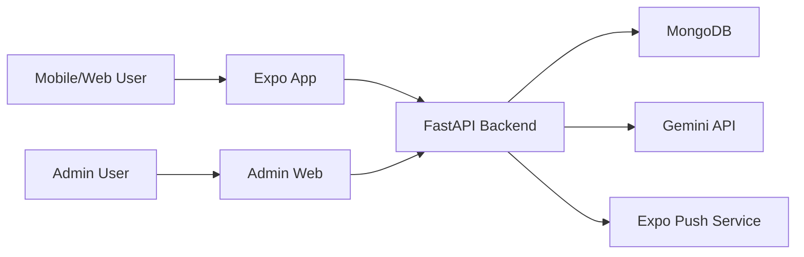

# Architecture

## Overview

PmubLonab is a three-part system:

- Expo React Native frontend, exported to web for staging.
- React/Vite admin web app.
- FastAPI backend backed by MongoDB.

PDF parsing is handled by the backend using `pdfplumber` for text extraction and Gemini for structured JSON extraction.

## High-Level Flow

## Frontend App

Location: `frontend/`

Responsibilities:

- Display programmes, partants, pronostics, stats, archives, and results.
- Register push tokens on supported native platforms.
- Cache selected initial data for faster repeat opens.
- Provide a mobile-first UX and web-compatible staging build.

Key routes:

- `app/(tabs)/programmes.tsx`
- `app/(tabs)/partants.tsx`
- `app/(tabs)/pronostics.tsx`
- `app/(tabs)/stats.tsx`
- `app/(tabs)/archives.tsx`
- `app/resultats.tsx`
- `app/race/[race_id].tsx`

## Admin Web

Location: `admin-web/`

Responsibilities:

- Authenticate admins.
- Upload PDFs.
- Show upload/admin status.
- List races.
- Set current race.
- Delete races.
- Send/administer announcements and notifications.

## Backend

Location: `backend/`

Responsibilities:

- Serve public race/programme/result APIs.
- Parse uploaded PDFs.
- Store race documents.
- Manage admin auth.
- Manage push tokens and notifications.
- Provide stats and search endpoints.

Important files:

- `server.py`
- `pdf_parser.py`
- `race_data.py`
- `auth.py`

## Data Store

MongoDB stores:

- races
- admin users
- admin logs
- announcements
- push tokens
- favorites

The `races` collection currently stores both programme documents and result-only documents, with `doc_type` distinguishing them.

## Deployment

Current staging deployment uses Render:

- backend API web service
- frontend static site
- admin static site

MongoDB Atlas is used for staging data.

## Known Architecture Gaps

- Need result/programme linking.
- Need upload deduplication.
- Need parse quality report storage.
- Need admin correction endpoints.
- Need precomputed analytics as historical data grows.
- Need production runbook and backup policy.
